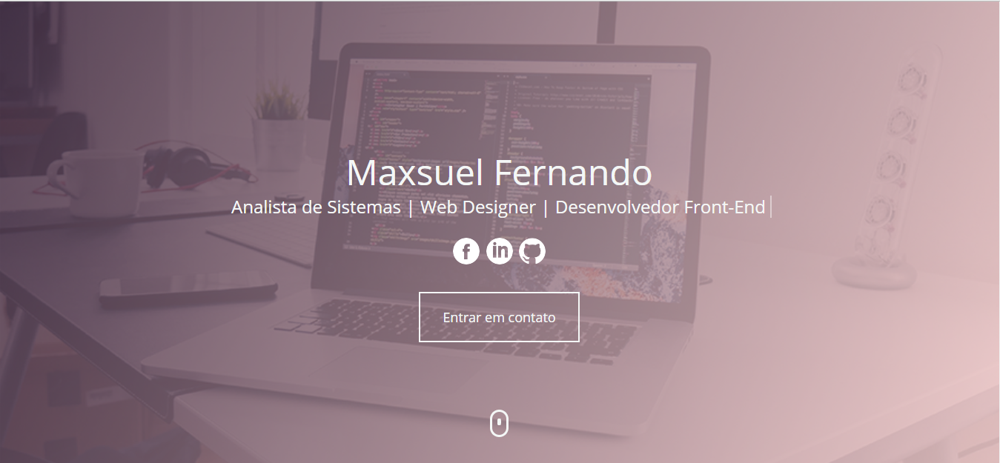
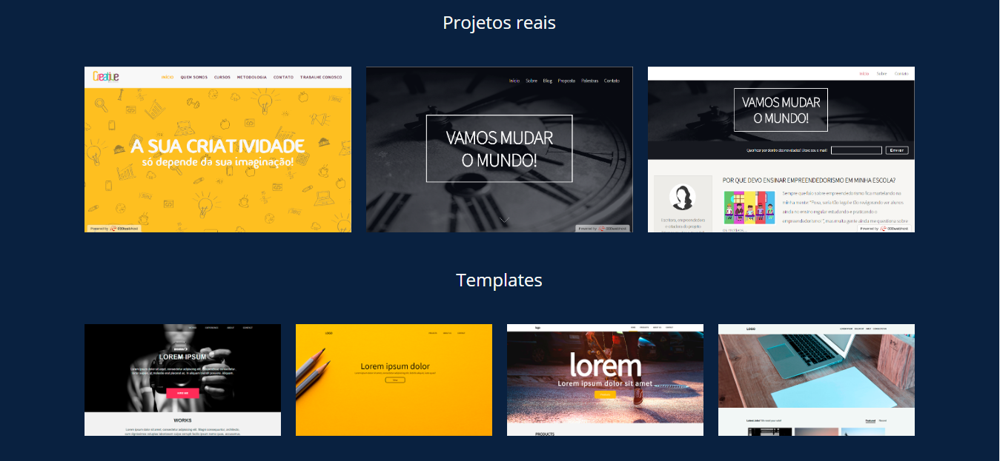
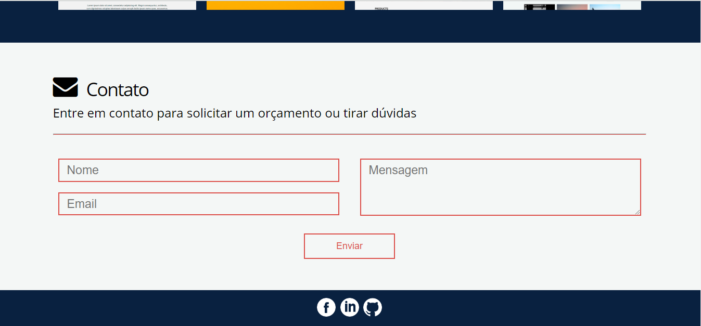

# maxsuelfernandob


## Sobre o projeto

maxsuelfernandob é meu portfólio como Web Designer, utilizando HTML, CSS, JavaScript, PHP e Bootstrap.

<br>

### Layout Web







<br>

## Tecnologias utilizadas

### Back-End
* PHP

### Front-End
* HTML
* CSS
* JavaScript

<br>

## Como executar o projeto
```bash
# clonar repositório
git clone git@github.com:maxsueldev/maxsuelfernandob.git

# entrar na pasta do projeto e abrir o arquivo index.html
```

<br>

## Autor
Maxsuel Santos

<https://www.linkedin.com/in/maxsuelfernandob/>
